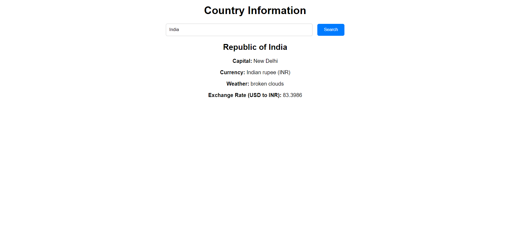

# Countries World

This project provides information about different countries, including details such as country name, capital, currency, weather and exchange rates.

## Description

The project is built using Node.js, Express.js, Axios, and HTML/CSS/JavaScript. It fetches data from various APIs to display comprehensive details about a country based on user input.

## Getting Started

To run the project locally, follow these steps:

1. Clone this repository to your local machine: `https://github.com/TechnoPhasePRO/countries_world`.
2. Navigate to the project directory in your terminal.
3. Install dependencies using `npm install`.
4. Start the server using `node index.js`.
5. Open your web browser and go to `http://localhost:3000`.
6. Enter the name of a country in the provided input field and submit the form to view details.

## Technologies Used

- Node.js
- Express.js
- Axios
- HTML/CSS/JavaScript

## Credits

- [Rest Countries API](https://restcountries.com/) for country data.
- [OpenWeatherMap API](https://openweathermap.org/) for weather data.
- [ExchangeRate-API.com](https://www.exchangerate-api.com/) for exchange rate data.

## Screenshots

## License

This project is licensed under the MIT License - see the [LICENSE](LICENSE) file for details.
